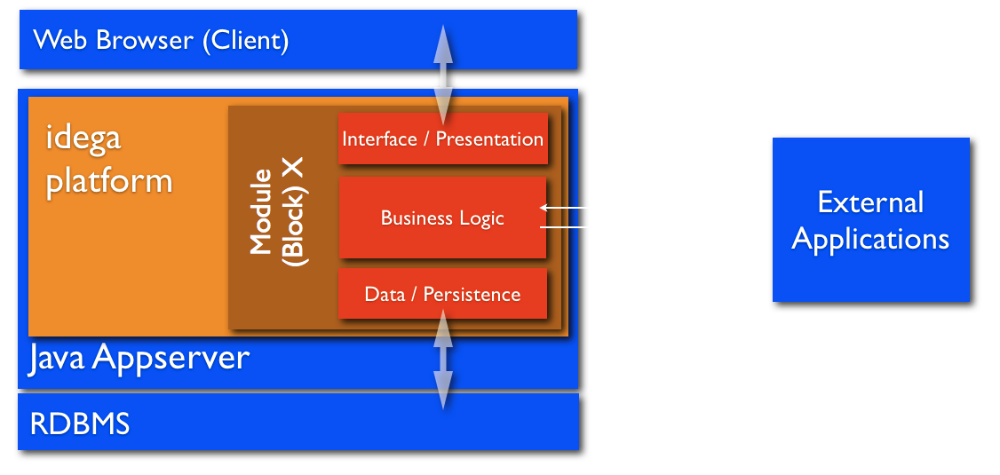
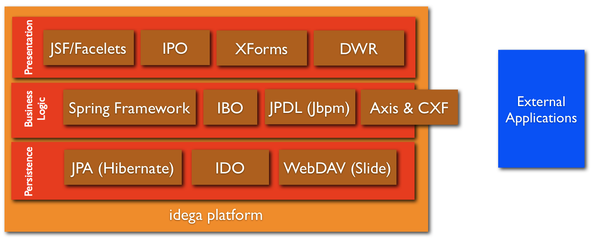

Architecture
------------

The idega platform is based on a component based and modular design philosophy where the system is based on several components that make together the whole solution like lego blocks build a whole house. 

Each module is based on several components and typically each module has at least three layers: A presentation, business logic and persistence layer. Each module in the idega platform is packaged as a independent unit (typically jar file) and is called a "Block" or a "Bundle". The idega platform ships with tens of pre-made "Bundles" but more than 200 exist in the open source repository. Each Block typically makes use of integrated frameworks to build the components in each of these layers like illustrated below:

This diagram shows some of the main frameworks, subsystems and facilities integrated into the idega platform. These are:

Presentation Layer
==================
* **JSF** - A Java Server Faces and Facelets engine is integrated into the platform and are the default way of writing new presentation level user interface and components. The platforms built in portal builder tool is integrated with this so that Facelet style pages can be built visually and the fly from existing components.

* **IPO** - Idega Presentation Objects is the older component architecture of the platform but is still compliant with the JSF main component structure by extending JSF's base class UIComponent

* **XForms** - A rendering engine for XForms is included and is also integrated with the workflow JBPM Engine. It takes care of rendering XForms markup to standard HTML/XHTML and the FormBuilder is a tool for visually building up dynamic XForms forms which can be used to build user interface on business processes.

* **DWR** - The DWR Engine is integrated and can be used to dynamically bridge together Server-Side Java code with client-side JavaScript code to enable AJAX-style responsive User Interfaces.

Business Logic Layer
===================

* **Spring Framework** - The Spring Framework is integrated throughout the platform and is integrated with most of the main subsystems to make development more with less code and more flexibility.

* **IBO** - Idega Business Objects is the older style of modelling business logic level components and is a simplified form of the EJB Session Bean architectcture.

* **JPDL** - Workflows and Business processes may be modelled dynamically and declaratively in JPDL (or other workflow languages) and deployed into the systems integrated JBPM workflow engine and linked together with other parts such as user interface components, forms or back end logic or persistence.

* **Axis & CXF** - Both Axis and CXF Engines are provided to build services to integrate with other systems through XML services with technologies such as XML, SOAP or REST services. These may be developed with JAX-WS so that web services can be developed with regular "POJO" style Java classes with annotations.

Peristence Layer
================

* **JPA** - Hibernate is integrated as the default persistence Object-to-Relational-Mapping engine and the recommended way of writing persisntent objects is to be compliant with the Java Persistence API standard. The JPA standard makes it possible to develop complex persistent objects with regular "POJO" style Java classes with annotations.

* **IDO** - Idega Data Objects is the older style of developing persistent java classes and is a simplified form of the EJB "Bean Managed Persistence" architectcture.

* **WebDAV** - WebDav is integrated as the platforms default "filesystem" and repository for content. This makes it easy to write and read files and this can be used to "mount" the platforms filesystem in the client as a "remote hard disk".

