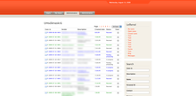
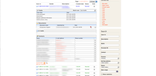

Case Management System
----------------------

The idega platform has been used extensively in eGovernment type applications and there the case registry is an important cornerstone. The Case system collects all in one place all cases created by a user in the system. This can be used as a base for different type of messages, forms/applications that is routed between persons. This is in turn integrated with both the Form Engine/Builder and can the BPM system in a way so that the case data can travel through dynamic process.

Features
------------

 * Complete overview of running processes and cases
 * Unified interface for tasks, documents, emails, messages and relevant contacts of cases
 * Very flexible access control
 * BPM built processes or coded process via API
 * Built in comments component with attachments, monitoring and RSS support
 * Excel export
 * Search
 * Metrics Reports