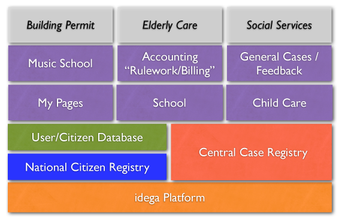
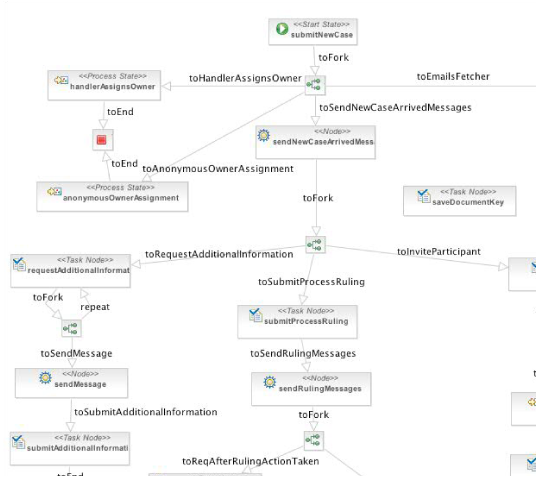

eGovernment
------------

The idega solutions have been extensively used for self-service and eGovernment type applications. This includes solutions for municipalities and government agencies. The solutions have been designed to have a general foundation which makes them applicable to different countries. The solutions have so far been implemented in several government instutions in the Nordic Countries, to date chiefly Iceland and Sweden.

Municipalities
--------------

Several specialiced modules have been developed for municipal specialized processes such as for elementary school registration/choice, school meals, childcare homes, music schools, after-school care, seminars, property tax handling, car parking etc. In some cases this has been integrated with e-certificates for digital signatures of contracts. This is all integrated into the national/regional citizen registry and all cases are collected in a central case registry that is linked to each citizens' personal view in the portal.

The diagram illustrates how some of these modules are built on-top of the core idega platform

Government Agencies
------------------

Several specialiced modules have been developed for government agency special processes such as for grant handling, posting general cases, complaints or feed back.

Business Processes and Workflow
-------------------------------

In version 4 of the idega platform it was augmented with a dynamic process engine which can be used to build workflows connected to government processes which is in turn can be linked to a central case registry. These processes can be designed visually with a process designer tool where an example can be seen below:

These workflows are in turn linked to the Form Engine where typicall each task in the workflow corresponds to a form built in the Form Builder. These forms can just as well as the processes be dynamically changed whenever needed to meet new business needs.