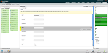
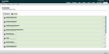

Form Builder
------------

The Form Engine/Builder is based around a RAD tool for building forms visually in a browser. These forms can either be simple forms whos submissions are just stored in a flat list or be part of a more complicated process that is running inside the BPM Engine.

Features
------------

 * Web 2.0 [XForms](http://www.w3.org/MarkUp/Forms/) builder based on [Chiba](http://www.chiba-project.org)
 * Style-able and interactive
 * Saveable forms
 * Plug-able
 * Reusable components
 * PDF Export
 * Multi data sources
 * Versioning and Live Update