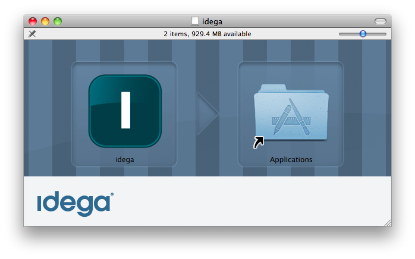

Getting started
---------------

**DOWNLOADING PRE-BUILT BINARY WAR FILE AND CONFIGURED TOMCAT 6.0.35 :**

Download [here](https://www.dropbox.com/sh/xd1qtvsxwwkzqo8/jG40LwxrqF)
<!--
The Idega's ePlatform comes with a double-clickable GUI application for easy evalutation and testing of the solution. The application runs an embedded web, application and database server.

Download for:

* [Mac OS X Leopard/Snow Leopard](http://repository.idega.com/maven2/com/idega/app/com.idega.app.eplatform.mac/4.1.3-SNAPSHOT/com.idega.app.eplatform.mac-4.1.3-20091126.121456-1.dmg)
* [Windows XP/Vista/7](http://repository.idega.com/maven2/com/idega/app/com.idega.app.eplatform.win32/4.1.3-SNAPSHOT/com.idega.app.eplatform.win32-4.1.3-20091126.212618-4.zip)
-->

The initial user login is Administrator/idega

The idega platform supports the [RapidWeaver](http://www.realmacsoftware.com/rapidweaver/) theme format (packaged as a zip).
To get started with a portal layout it is easiest to upload a theme (Under The Lucid/Themes option under the Workspace UI).

Here is a simple theme you can download to get started: 

**BUILDING FROM SOURCE - FROM HEAD/"Development branch":**

The main development site for the idega platform is [here](http://github.com/idega) on Github where all the submodules available for the idega plaform are hosted and located. You need to use your [GitHub](https://github.com/) account in order to download the code.

**Make sure the following are installed for building and compiling:**

 * [Java 5/6/7 SDK](http://java.sun.com)
 * [Apache Maven 2.x] (http://maven.apache.org)
 * [Git](http://www.git-scm.org)

For running you will need a Java EE Servet container and a an SQL database.

**Tomcat and MySQL are recommended:**

 * [Tomcat 6.x](http://tomcat.apache.org) 
 * [MySQL 5.1.x](http://www.mysql.org)
 
It is also possible to run with an embedded Java database such as hsqldb:

 * [HSQL 1.8.x](http://www.hsqldb.org)

Now Checkout the main (platform) project from github:

	git clone git://github.com/idega/com.idega.block.platform.git
	cd com.idega.block.platform
	git submodule init
	git submodule update
	git submodule foreach git checkout master
	git submodule foreach git pull

One IMPORTANT note:
The default checkout is for contributors (we may change that) so BEFORE git submodule init, open the file .gitmodules and change all : 
git@github.com:idega/...
to the public clone url
git://github.com/idega/...
This goes for all of the parent modules.
You may have to issue a:

	git submodule sync

if you did any of the git submodule commands before changing the .gitmodules file

Add the idega maven repository to your settings.xml (under ~/.m2)

	<settings xmlns="http://maven.apache.org/SETTINGS/1.0.0"
	  xmlns:xsi="http://www.w3.org/2001/XMLSchema-instance"
	  xsi:schemaLocation="http://maven.apache.org/SETTINGS/1.0.0
	                      http://maven.apache.org/xsd/settings-1.0.0.xsd">
	  <profiles>
	    <profile>
	     <id>idega</id>
	      <repositories>
	        <repository>
	          <id>idega1</id>
	          <name>Idega Main Repository</name>
	          <url>http://repository.idega.com/maven2</url>
	          <releases>
	            <enabled>true</enabled>
	            <updatePolicy>always</updatePolicy>
	            <checksumPolicy>warn</checksumPolicy>
	          </releases>
	          <snapshots>
	            <enabled>true</enabled>
	            <checksumPolicy>fail</checksumPolicy>
	          </snapshots>
	          <layout>default</layout>
	        </repository>
	      </repositories>
	      <pluginRepositories>
	      </pluginRepositories>
	    </profile>
	  </profiles>
	  <activeProfiles>
	    <activeProfile>idega</activeProfile>
	  </activeProfiles>
	</settings>

Build all modules with maven:

	cd com.idega.block.platform
	mvn clean install
	
	
Do the same with the addon and egov modules

	git clone git://github.com/idega/com.idega.block.addon.git
	cd com.idega.block.addon
	git submodule init
	git submodule update
	git submodule foreach git checkout master
	git submodule foreach git pull
	mvn clean install
	
and:

	git clone git://github.com/idega/com.idega.block.egov.git
	cd com.idega.block.egov
	git submodule init
	git submodule update
	git submodule foreach git checkout master
	git submodule foreach git pull
	mvn clean install

Checkout the Idega's Maven plugin to build WAR file:

	git clone git://github.com:idega/com.idega.maven.webapp.git
	cd com.idega.maven.webapp
	mvn clean install
	
Now checkout the main idega webapp:

	git clone git://github.com/idega/idega-webapp-base.git
	cd idega-webapp-base
	mvn clean package install
	
Now under the target you have a ready built Java webapp or WAR archive

Deploy the webapp into your tomcat installation e.g. by directing tomcat to it with a context file.

Create a file in your Tomcat installation under conf/Catalina/localhost named ROOT.xml:

	<Context path="" docBase="[WEBAPP_FOLDER]/target/idega-base-webapp-4.1.3-SNAPSHOT" reloadable="false" debug="0" swallowOutput="true" liveDeploy="false">
	
	<Resource name="jdbc/DefaultDS" type="javax.sql.DataSource"
	        url="jdbc:mysql://localhost/[DATABASENAME]?autoReconnect=true"
	        driverClassName="com.mysql.jdbc.Driver"
	        username="[DBUSER]"
	        password="[DBPASSWORD]"
	        maxActive="20"
	        maxIdle="5"
	        maxWait="10000"
	        removeAbandoned="true"
	        removeAbandonedTimeout="300"
	        logAbandoned="true"
	        testOnBorrow="true"
	        validationQuery="SELECT 1"
	  />
	
	</Context>

If you run under the "/" (ROOT) context you will first need to remove the Tomcat default ROOT webapplication under webapps folder, and you will ned to create and specify the database that you point the system to and install a JDBC library jar file (in the tomcat's lib folder). The JDBC library for MySQL can be downloaded from Mysql [here](http://dev.mysql.com/downloads/connector/c/6.0.html).

It is recommended to set Java options to increase the default memory allocation by setting the CATALINA_OPTS variable in your bin/startup.sh or bin/startup.bat like e.g.:

	export CATALINA_OPTS="-Xmx256M -XX:MaxPermSize=128M -Dfile.encoding=UTF-8 -Djava.awt.headless=true -XX:+HeapDumpOnOutOfMemoryError -XX:MinHeapFreeRatio=20 -XX:MaxHeapFreeRatio=40"

Now start the Tomcat with bin/startup.sh or bin/startup.bat

If everything went successfully you whould now have a running webapplication on [http://localhost:8080](http://localhost:8080).
The default login is Administrator/idega.
