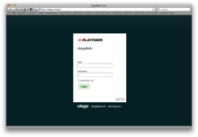

Welcome to idega open source platform!
--------------------------------------

The idega platform is a modular web applaction platform based on Java

idega is used for:

 * eGovernment
 * Portals
 * Sports Membership management
 * Sports tournament systems (Golf, Motor-Cross and Running)
 * Travel booking
 * Online sales
 * Consumer complaints handling
 * Grant application handling
 * Tenders handling
 * Church management
 * Committee processes
 * Grant application handling
 * Tender process handling
 * And much more...

What makes idega special is its flexibility because of it's modular structure and today there exist over 200+ modules ranging from general functionality to highly specific.
This is why idega can easily be customized for different types of web applications and therefore all of the above mentioned different vertical solutions can be assembled on top of the idega base system.

If you are a developer can check out the great collection of modules on our code repository on [github](http://github.com/idega). Most of the modules are [Maven 2 modules](http://maven.apache.org) modules, but some of them are [Maven 1](http://maven.apache.org/maven-1.x/) or [OSGi](http://www.osgi.org)

Getting Started
--------------

To get started go [here](gettingstarted.html)

Features and Components
--------------

To see an overview of the platforms main features and components go [here](components.html)
