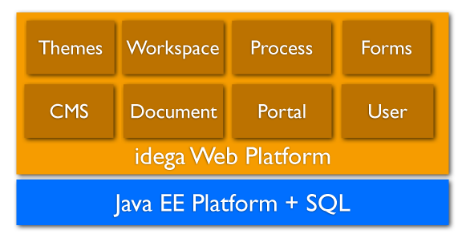
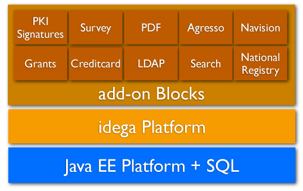

Introduction
------------

The idega platform is engineered to be a general foundation for a variety of different web solutions and several different types of vertial solutions have been built to date on top of the base idega core platform.

Base platform
-------------

The base idega platform includes several general and basic components such as a portal platform which is the central core of most solutions and more recently in v4 of the platform additions have been made such as a Form Builder/Engine and a Process/Workflow engine which are integrated together to build dynamic business processes.

The diagram below illustrates some of the basic core modules of the idega platform.

Add-on modules
--------------

The idega platform is built with extensibility in mind so a multitude of add-on modules exists for various special functions that are built on-top of the base platform. 

The diagram below illustrates some of the add-on modules that are available as plug-ins to the base system:

