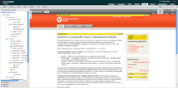
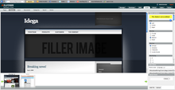

Portal Builder/Designer and CMS/DMS
-----------------------------------

The idega platform is based around a Portal Designer that is used to dynamically design up a complicated dynamic portal/website. In this way a user can build up a portal rich with functionality without being a programmer and select from the range of hundreds of pre-programmed available components in the idega module collection.

Features
------------

 * Web 2.0 Portal Builder based on [Java Server Faces](http://java.sun.com/javaee/javaserverfaces/)
 * Theme-able
 * User, Group management
 * Advanced security controls
 * Document Management
 * Component based
 * Completely Localizable
 * Remote drive access (WebDAV)