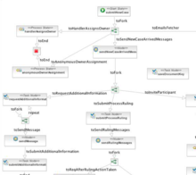

Business Process Management System
----------------------------------

The BPM System is geared towards making it easy do develop flexible business processes and is integrated with the Forms Engine/Builder.

Features
--------------------------

 * BPM Engine based on [JBoss JBPM](http://www.jbpm.org)
 * Visual Designer
 * XForms integration
 * Case log integration
 * DMS integration
 * Versioned processes
 * Hot-Updateable